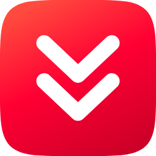
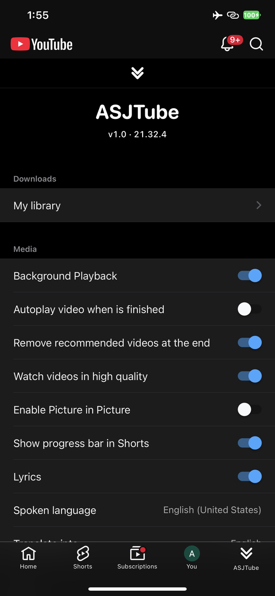
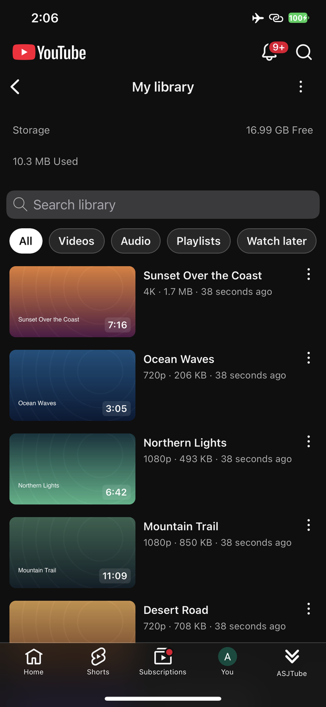
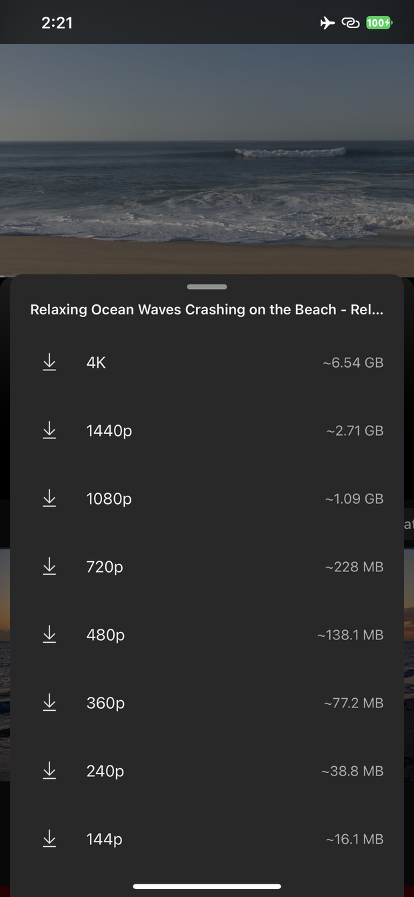
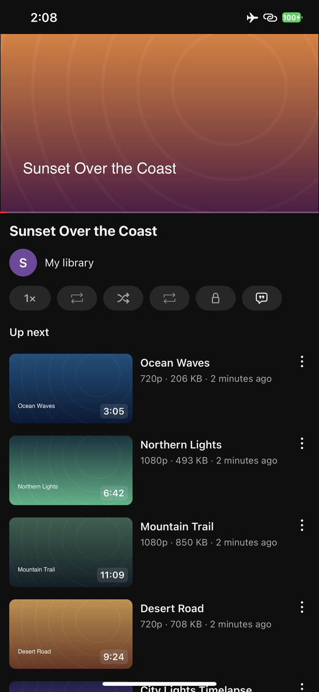
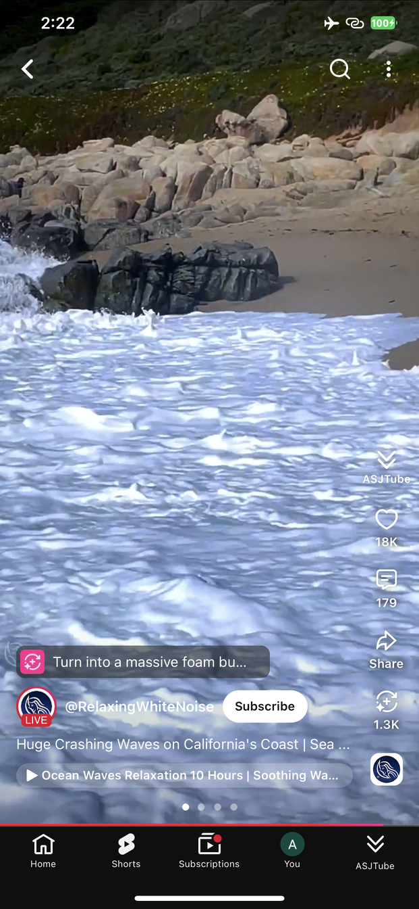
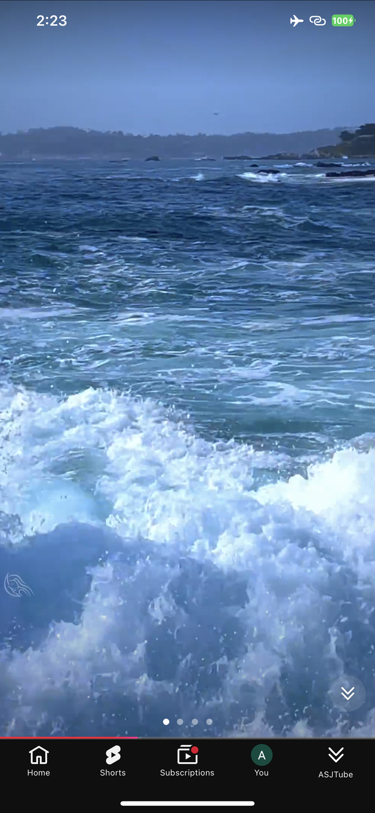

<div align="center">

<picture>
  <source media="(prefers-color-scheme: dark)" srcset="icon/icon-dark.png">
  
</picture>

# ASJTube

**Downloads, background audio and an ad-free YouTube — without changing how the app looks.**

<sub>79 languages</sub>

Add the source in Sileo, Zebra, Cydia or Installer:

```
https://apt.ahmadrashed.com
```

Signing it yourself? `https://source.ahmadrashed.com` in ESign, Feather or KSign · `https://altstore.ahmadrashed.com` in AltStore or SideStore

[**ahmadrashed.com**](https://ahmadrashed.com) — the official website

[**ASJ Tweaks on Telegram**](https://t.me/ASJTweaks) — new tweaks and update notes

</div>

---

## Where it lives

One place: an **ASJTube** tab in YouTube's own bar. The settings, the library and everything else are behind it — no floating buttons, no gestures to learn.

<p align="center">
  
  
  
</p>

Saving works from four places: the button in the row under the video, a long press on the player, the button on a Short, and YouTube's own Download row.

---

## Features

### Downloads


- **Save any video or Short** — every rung the video has, with the size before you commit
- **My Library** — a feed of what you saved, laid out like Home
- **Playlists**, **Watch later** and a **storage bar**
- Background playback and Picture in Picture for your own files

<br clear="right">

### Playback


- **Watch videos in high quality** — pinned to the best rendition the video has
- **Background Playback** — audio keeps going when you leave the app or lock the screen
- **Picture in Picture** — starts on its own, no button to press
- **Autoplay when a video finishes**, and no suggested grid at the end
- **Progress bar in Shorts**

<br clear="right">

### Ads


- **Remove Ads** — feed, search, Shorts and the player alike
- An ad is refused at the model, before a card is ever built, so there is no flash and no gap
- Non-skippable breaks are seeked past; skippable ones are skipped the moment the app allows it
- The Premium prompts, the upsell panels and the in-app surveys are all declined

<br clear="right">

### Extras


- **Lyrics** for the song a video plays
- **Clear Mode** — the whole interface out of the way on a Short
- **Copy and translate any text** — a title, a description, a comment or one of its replies, from a long press or from the comment's own menu
- **Hide Shorts**, **hide the create button**, **open the app on Shorts**
- **Require Face ID to open**
- **Open links in Safari** instead of the in-app browser

<br clear="right">

**79 languages** — the panel follows YouTube's own language, so an Arabic install gets Arabic screens without setting anything. Right-to-left languages mirror with the text.

---

## Install

### Jailbroken

Add the source above, or download a package from [Releases](../../releases) and install it with Sileo, Zebra or Cydia.

| Jailbreak | Package |
|---|---|
| Dopamine / palera1n (rootless) | `ASJTube` — `iphoneos-arm64` |
| checkra1n / unc0ver and similar (rootful) | `ASJTube` — `iphoneos-arm` |
| roothide | `ASJTube (roothide)` |

Sileo, Zebra and Cydia pick the right architecture on their own; roothide is a separate entry.

### TrollStore

Fully supported, with a build of its own that keeps YouTube's own entitlements and its app extensions intact.

**[ahmadrashed.com/trollstore/tube](https://ahmadrashed.com/trollstore/tube)** — iOS 14.0–16.6.1, and 17.0 on some devices.

One link: on an iPhone with TrollStore it hands the file straight over, anywhere else it just downloads.

### Not jailbroken, no TrollStore

Add `https://source.ahmadrashed.com` in ESign, Feather or KSign and install it from there — that source also has the full build, with YouTube's own extensions. In AltStore or SideStore, add `https://altstore.ahmadrashed.com`.

Or download the **IPA** from [Releases](../../releases) and sign it with Sideloadly or ESign — the one with the newest YouTube needs iOS 17 or newer, `_21.33.6` is for iOS 16 — or take the **dylib** and inject it into your own copy of YouTube.

> The dylib is self-contained and does not need Cydia Substrate, so any injector works.
> YouTube itself is not distributed here — bring your own copy.

---

## Notes

- Works with the current YouTube and with older versions
- arm64 and arm64e
- Screenshots are from a real install, not mockups

<div align="center"><sub>by <a href="https://ahmadrashed.com">Ahmad Rashed</a></sub></div>
